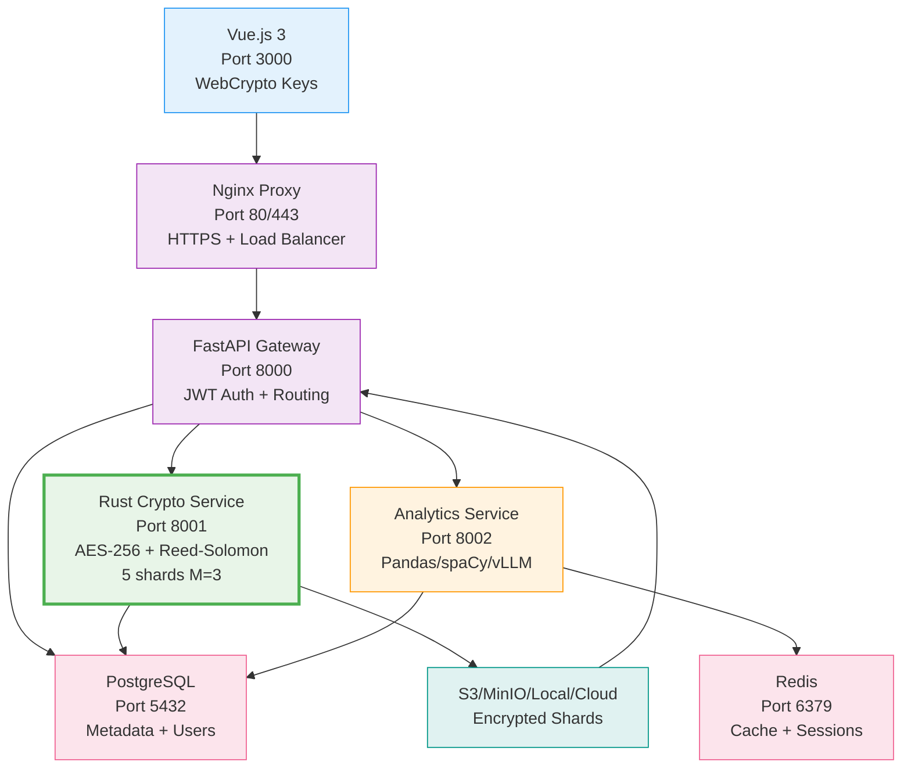

# Документация: Clodu storage 

## Обзор проекта

** Clodu storage** — интеллектуальная платформа для безопасного хранения и анализа данных. Файлы шифруются на клиенте, разбиваются на шарды с помощью Reed-Solomon и распределяются по разным хранилищам. Аналитика выполняется на метаданных и расшифрованных данных пользователя.

**Цели проекта:**

- Сквозное шифрование AES-256-GCM
    
- Распределенное хранение (M-of-N восстановление)
    
- Бизнес-аналитика (тренды, аномалии, классификация)
    
- Высокая производительность (Rust + Python)

**Оссобенности:**

- **Сквозное шифрование** — файлы шифруются на клиенте
    
- **M-of-N восстановление** — 3 из 5 шардов достаточно
    
- **Гибридное хранение** — S3 + локальные диски + облака
    
- **ML-аналитика** — тренды, аномалии, классификация документов
    
- **Rust-перформанс** — крипто в 10x быстрее Python
    
- **Zero-knowledge** — сервер не знает ключей/содержимого
    

## Архитектура

| Сервис        | Порт   | Язык     | Задачи                               | Масштаб      |
| ------------- | ------ | -------- | ------------------------------------ | ------------ |
| **nginx**     | 80/443 | -        | HTTPS, Load Balancer, Static files   | 1+           |
| **gateway**   | 8000   | Python   | Auth, Routing, WebSocket, API docs   | 2-4          |
| **crypto**    | 8001   | **Rust** | AES-256-GCM, Reed-Solomon шардинг    | 4-8          |
| **analytics** | 8002   | Python   | ML (классификация, тренды, аномалии) | 1-2 GPU      |
| **redis**     | 6379   | -        | Кэш аналитики, сессии                | 1-3          |
| **postgres**  | 5432   | -        | Метаданные, пользователи             | 1 (replicas) |

## Стек технологий

|Компонент|Технология|Порт|
|---|---|---|
|**API Gateway**|FastAPI (Python)|8000|
|**Аутентификация**|Rust (Axum)|8001|
|**Шифрование**|Rust / WebCrypto (AES-256-GCM)|8001|
|**Разбиение на части**|Rust (Reed-Solomon)|8001|
|**Аналитика**|FastAPI + Pandas/spaCy/Transformers|**8002**|
|**База данных**|SQLite/Postgres|5432|
|**Хранение частей**|S3 + локальное + облака|-|
|**Фронтенд**|Vue.js 3|3000|

 
## Аналоги и сравнение

| Сервис               | Шифрование            | Шардинг             | Аналитика     | Цена           | Особенности             |
| -------------------- | --------------------- | ------------------- | ------------- | -------------- | ----------------------- |
| **Clodu storage**    | ✅ Client-side AES-256 | ✅ M-of-N            | ✅ ML insights | 💰 Self-hosted | Open-source + аналитика |
| **IPFS/Filecoin**    | ❌ Server-side         | ✅ Content-addressed | ❌ Нет         | 💸 $0.02/GB    | Децентрализация         |
| **Dropbox Business** | ✅ At-rest             | ❌ Нет               | ✅ Базовая     | 💰 $15/польз.  | Централизованное        |
| **pCloud Crypto**    | ✅ Client-side         | ❌ Нет               | ❌ Нет         | 💰 $4.17/мес   | Закрытый код            |
| **Tresorit**         | ✅ Zero-knowledge      | ❌ Нет               | ❌ Нет         | 💰 $10.50/мес  | Европейское             |
| **Nextcloud**        | ✅ Опционально         | ❌ Нет               | ✅ Плагины     | 💰 Self-hosted | Тяжелый стек            |

